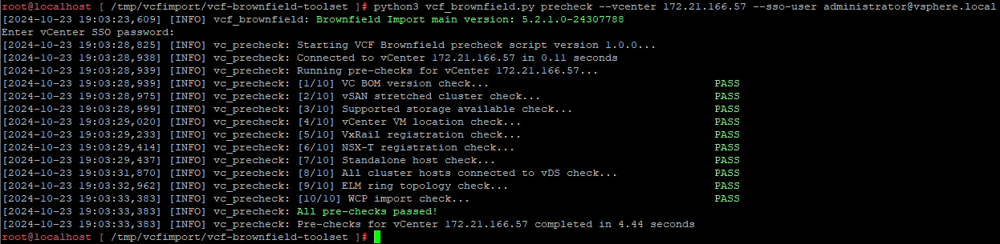

= 使用 VCF 匯入工具將 vSphere 叢集轉換為 VCF 管理域
:allow-uri-read: 
:icons: font
:imagesdir: ../media/

[role="lead"]
使用 VCF 匯入工具將現有的 vSphere 8 叢集轉換為 VCF 5.2 管理網域。您將驗證 vCenter 設備、部署 SDDC 管理器、建立 NSX 部署規格並執行轉換。

在 vCenter 設備和 SDDC 管理員上使用 Broadcom 的 VMware VCF 導入工具來驗證配置並為 vSphere 和 VCF 環境提供轉換和導入服務。

在適當的情況下，可以參考 VMware 文件以取得更多說明。

== 步驟 1：複製 VCF 導入工具並執行預檢查

使用 vCenter 設備上的 VCF 匯入工具來驗證 vSphere 叢集在 VCF 轉換或匯入過程中是否處於健康狀態。

.步驟
. 請依照 VMware 文件中的說明將 VCF 導入工具複製到目標 vCenter 設備： https://techdocs.broadcom.com/us/en/vmware-cis/vcf/vcf-5-2-and-earlier/5-2/copy-the-vcf-import-tool-to-the-target-vcenter-appliance.html["將 VCF 匯入工具複製到目標 vCenter Appliance"] 。
. 使用以下命令提取捆綁包：
+
[listing]
----
tar -xvf vcf-brownfield-import-<buildnumber>.tar.gz
----
. 請依照 VMware 文件中的說明執行驗證預檢查： https://techdocs.broadcom.com/us/en/vmware-cis/vcf/vcf-5-2-and-earlier/5-2/run-a-precheck-on-the-target-vcenter-before-conversion.html["轉換前對目標 vCenter 執行預檢查"] 。
. 以下輸出顯示 vCenter 設備已通過預先檢查。
+

== 步驟 2：部署 SDDC 管理器並建立 NSX 部署規範

在您計劃轉換為 VCF 管理域的相同 vSphere 叢集上部署 SDDC Manager 設備，然後為轉換程序建立 NSX 部署規格。

.步驟
. 請依照 VMware 文件中的說明部署 SDDC Manager 設備： https://techdocs.broadcom.com/us/en/vmware-cis/vcf/vcf-5-2-and-earlier/5-2/deploy-the-sddc-manager-appliance-on-the-target-vcenter.html["在目標 vCenter 上部署 SDDC 管理器設備"] 。
. 請依照 VMware 文件中的說明將主機新增至 SDDC Manager 清單： https://techdocs.broadcom.com/us/en/vmware-cis/vcf/vcf-5-2-and-earlier/5-1/commission-hosts.html["委員會主辦單位"] 。
+
以下是 NSX 部署的 JSON 檔案範例：

+
[listing]
----
{
  "license_key": "xxxxx-xxxxx-xxxxx-xxxxx-xxxxx",
  "form_factor": "medium",
  "admin_password": "************************",
  "install_bundle_path": "/tmp/vcfimport/bundle-133764.zip",
  "cluster_ip": "172.21.166.72",
  "cluster_fqdn": "vcf-m02-nsx01.sddc.netapp.com",
  "manager_specs": [{
    "fqdn": "vcf-m02-nsx01a.sddc.netapp.com",
    "name": "vcf-m02-nsx01a",
    "ip_address": "172.21.166.73",
    "gateway": "172.21.166.1",
    "subnet_mask": "255.255.255.0"
  },
  {
    "fqdn": "vcf-m02-nsx01b.sddc.netapp.com",
    "name": "vcf-m02-nsx01b",
    "ip_address": "172.21.166.74",
    "gateway": "172.21.166.1",
    "subnet_mask": "255.255.255.0"
  },
  {
    "fqdn": "vcf-m02-nsx01c.sddc.netapp.com",
    "name": "vcf-m02-nsx01c",
    "ip_address": "172.21.166.75",
    "gateway": "172.21.166.1",
    "subnet_mask": "255.255.255.0"
  }]
}
----
. 將 JSON 檔案複製到 SDDC 管理員上的目錄。

NOTE: 在轉換或匯入作業中部署 NSX Manager 叢集時，使用 NSX-VLAN 網路。有關 NSX-VLAN 網路限制的信息，請參閱 VMware 文件： https://techdocs.broadcom.com/fr/fr/vmware-cis/vcf/vcf-5-2-and-earlier/5-2/considerations-before-converting-or-importing-existing-vsphere-environments-into-vcf.html["將現有 vSphere 環境轉換或匯入 VMware Cloud Foundation 之前的注意事項"] 。

== 步驟 3：將軟體上傳到 SDDC 管理器

請依照 VMware 文件中的說明將 VCF 匯入工具包和 NSX 部署工具包上傳到 SDDC 管理員： https://techdocs.broadcom.com/us/en/vmware-cis/vcf/vcf-5-2-and-earlier/5-2/seed-software-on-sddc-manager.html["將所需軟體上傳至 SDDC 管理器設備"] 。

確保將 VCF 導入工具和 NSX 部署包複製到 SDDC 管理器上的下列目錄： `/home/vcf/vcfimport` 。

== 步驟4：將vSphere叢集轉換為VCF管理域

請依照 VMware 文件中的說明將 vSphere 叢集轉換為 VCF 管理域： https://techdocs.broadcom.com/us/en/vmware-cis/vcf/vcf-5-2-and-earlier/5-2/import-workload-domain-into-sddc-manager-inventory.html["將 vSphere 環境轉換或匯入 SDDC Manager 清單中"] 。

使用下列命令將vSphere叢集轉換為VCF管理網域並部署NSX叢集：

[listing]
----
python3 vcf_brownfield.py convert --vcenter '<vcenter-fqdn>' --sso-user '<sso-user>' --domain-name '<wld-domain-name>' --nsx-deployment-spec-path '<nsx-deployment-json-spec-path>'
----
在哪裡：

* `<vcenter-fqdn>`是您的 vCenter 伺服器的完全限定域名
* `<sso-user>`是單一登入使用者帳戶
* `<wld-domain-name>`是您的工作負載域所需的名稱
* `<nsx-deployment-json-spec-path>`是步驟 2 中建立的 NSX 部署 JSON 檔案的路徑

TIP: 您可以透過執行來查看所有可用的 VCF 匯入工具功能 `python3 vcf_brownfield.py --help`從 `/home/vcf/vcf-import-package/vcf-brownfield-import-<version>/vcf-brownfield-toolset`目錄。

== 步驟 5：向 VCF 新增許可

完成轉換後，將許可證新增至VCF環境。

.步驟
. 登入 SDDC 管理器 UI。
. 在導覽窗格中導覽至*管理>許可*。
. 按一下“*+ 許可證金鑰*”。
. 從下拉式選單中選擇一個產品。
. 輸入許可證密鑰。
. 提供許可證的描述。
. 按一下“*新增*”。
. 對每個許可證重複這些步驟。

== 附加資訊

* 有關 VCF 導入工具的更多信息，請參閱 VMware 文件：link:https://techdocs.broadcom.com/us/en/vmware-cis/vcf/vcf-5-2-and-earlier/5-2/map-for-administering-vcf-5-2/importing-existing-vsphere-environments-admin/vcf-import-tool-options-and-parameters-admin.html["VCF 導入工具選項和參數"] 。

